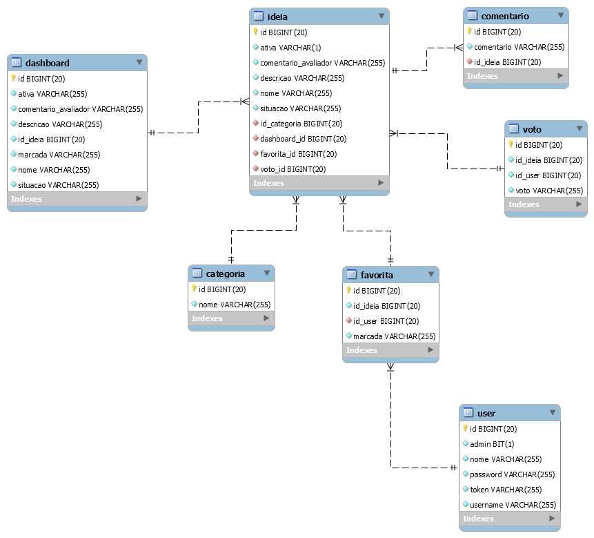

# Representação da Arquitetura

## Modelo de Arquitetura

O modelo utilizado para a execução do projeto foi o MVC. Por ele ser muitos projetos devido à arquitetura que possui, o que possibilita a divisão do projeto em camadas muito bem definidas. Cada uma delas, o Model, o Controller e a View, executa o que lhe é definido e nada mais do que isso.

Na primeira camada, temos o front-and, aonde o mesmo solicita os dados ao servido através de uma API. Após fazer essa requisição, o back-and processas os  dados retorna Eles  para o  front-and, aonde o mesmo expo os dados para o  usuário.

### Banco de Dados

